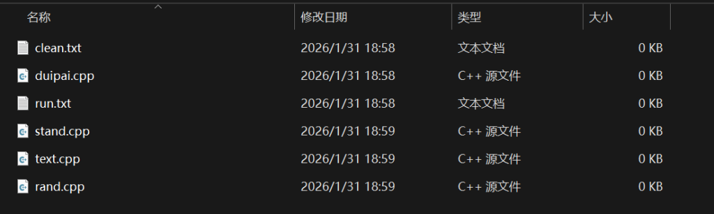
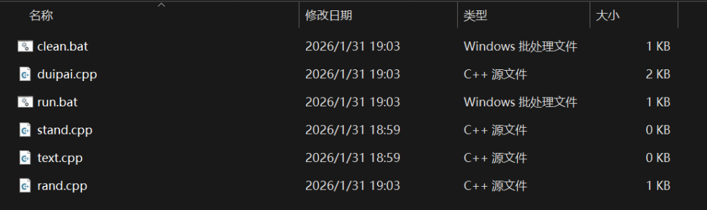

## 介绍对拍

对拍是指对两个程序的输出文件进行比较。

本文利用这一工具粗略实现对代码正确性的检验，辅助debug。

## 介绍对拍器组成部分

#### 1、stand.cpp

不考虑复杂度限制的正确代码

可以是暴力代码，也可以是已经AC的代码

#### 2、text.cpp

待检验的代码

#### 3、rand.cpp

生成随机数据的代码

#### 4、duipai.cpp

对拍，比较两份代码的输出

#### 5、run.bat

脚本，实现主流程

#### 6、clean.bat

脚本，清除多余文件，只保留出错的数据 （ WA.txt ）

## 原理介绍

1. rand.cpp 生成一份随机数据。

3. tand.cpp 与 text.cpp 分别处理这份数据，得到两份输出。

5. duipai.cpp比较这两份输出是否相同
    - 如果相同：说明目前没有出错，重复流程 1，2，3
    
    - 如果不同：说明出错了，进入流程 4

7. 保留导致出错的数据，结束。

## 代码实现

#### rand.cpp辅助模板

```
#include <bits/stdc++.h>
using namespace std;
std::mt19937_64 rng(std::chrono::steady_clock::now().time_since_epoch().count());
//返回一个[l,r]的随机数
template<typename T>T get_rand(T l, T r) {
    uniform_int_distribution<T> dis(l, r);
    return dis(rng);
}
//打印一个[l,r]的随机数
template<typename T>void pri(T l, T r) {
    uniform_int_distribution<long long> dis(l, r);
    cout<<dis(rng);
}
//打印 n 个[l,r]的随机数
template<typename T>void pri_arr(int n, T l, T r) {
    uniform_int_distribution<long long> dis(l, r);
    for (int i = 1; i < n; i++) {
    cout<<dis(rng)<<' ';
    }
    cout<<dis(rng)<<'\n';
}

int main() {
    
}
```

#### duipai.cpp

```
#include <bits/stdc++.h>
using namespace std;
//手动实现比较函数
bool compareFiles(const string& file1, const string& file2) {
    ifstream f1(file1), f2(file2);
    string s1, s2;
    ostringstream oss1, oss2;
    oss1 << f1.rdbuf();
    oss2 << f2.rdbuf();
    s1 = oss1.str();
    s2 = oss2.str();
    while (!s1.empty() && isspace(s1.back())) s1.pop_back();
    while (!s2.empty() && isspace(s2.back())) s2.pop_back();
    return s1 == s2;
}
int main() {
    int test_case = 1;
    while (true) {
        //生成随机数据
        system("rand.exe > input.txt");
        
        //stand.cpp和text.cpp分别处理数据
        system("stand.exe < input.txt > stand_out.txt");
        system("text.exe < input.txt > text_out.txt");
        
        //比较输出
        if (!compareFiles("stand_out.txt", "text_out.txt")) {
            cout << "\nWA\n";
            break;
        }
        cout << "AC #" << test_case << endl;
        test_case++;
    }
    
    return 0;
}
```

#### run.bat

```
@echo off
cls
echo 编译中...
echo.
 
:: 编译所有程序
g++ -o rand.exe rand.cpp -std=c++17 -O2 2>nul
if errorlevel 1 (echo ? rand.cpp 失败 & pause & exit)
echo ? rand
 
g++ -o stand.exe stand.cpp -std=c++17 -O2 2>nul
if errorlevel 1 (echo ? stand.cpp 失败 & pause & exit)
echo ? stand
 
g++ -o text.exe text.cpp -std=c++17 -O2 2>nul
if errorlevel 1 (echo ? text.cpp 失败 & pause & exit)
echo ? text
 
g++ -o duipai.exe duipai.cpp -std=c++17 -O2 2>nul
if errorlevel 1 (echo ? duipai.cpp 失败 & pause & exit)
echo ? duipai
 
echo.
echo 编译成功
echo.
echo Ctrl+C 退出
echo.
 
duipai.exe
pause
```

#### clean.bat

```
@echo off >nul 2>&1
if exist input.txt (
    (echo Sample Input & type input.txt & echo. & echo Sample Output & type stand_out.txt & echo. & echo Wa Output & type text_out.txt) > WA.txt 2>nul
)
del input.txt stand_out.txt text_out.txt *.exe 2>nul >nul
```

## 初始配置

#### 1、新建一个文件夹

添加以下 6 个文件



注意两个脚本初始为 txt 文件

#### 2、将上方的代码复制粘贴进对应的文件

然后将后缀 .txt 改为 .bat



至此已经完成了初始配置。

## 使用方法

1. 编写符合题目输入要求的 rand.cpp

3. 粘贴 stand.cpp 和 text.cpp

5. 双击运行 run.bat

7. 双击运行 clean.bat

9. 查看 WA.txt
