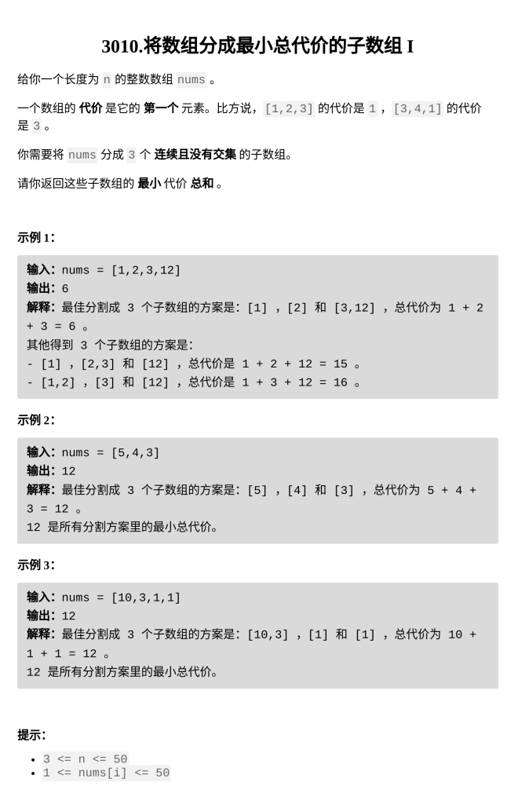

  
[3010.将数组分成最小总代价的子数组 I](https://leetcode.cn/problems/divide-an-array-into-subarrays-with-minimum-cost-i/)

  
题目难度：Easy



## 思路

第一部分的开头是确定的 _nums \[ 0 \]_

第二部分，第三部分的开头可以从 _nums \[ 1, n-1 \]_ 中任选

即找出 _nums \[ 1, n-1 \]_ 中的 **最小值** 和 **次小值**

### AC code

```
class Solution {
public:
    int minimumCost(vector<int>& nums) {
        int n=nums.size();
        int mm=51;//最小值
        int m=51;//次小值
        for(int i=1;i<n;++i){
            if(nums[i]<mm){
                m=mm;
                mm=nums[i];
            }
            else if(nums[i]<m){
                m=nums[i];
            }
        }
        return nums[0]+m+mm;
    }
};
```
