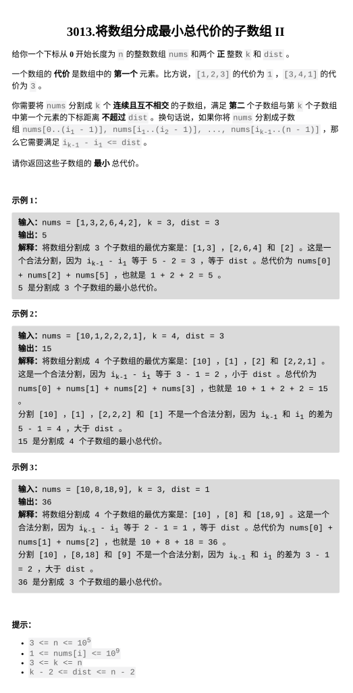

[3013.将数组分成最小总代价的子数组 II](https://leetcode.cn/problems/divide-an-array-into-subarrays-with-minimum-cost-ii/description/?envType=daily-question&envId=2026-02-02)

题目难度：Hard  



## 思路

定长窗口 ， 维护前 **_k_** 小 _**sum**_

实现一个数据结构 **_topksum_** , 功能如下 ：

```
class topKsum{
        int k;
        multiset<int>L,R;
        long long sum;
        public:
        topKsum(int k):k(k),sum(0){
            L.clear();
            R.clear();
        }
        long long getsum(){
            return sum;
        }        
        void add(int val){
            if(L.size()<k){
                L.insert(val);
                sum+=val;
            }
            else{
                auto it=prev(L.end());
                if(val<*it){
                    sum-=*it;
                    sum+=val;
                    R.insert(*it);
                    L.erase(it);
                    L.insert(val);
                }
                else{
                    R.insert(val);
                }
            }
        }
        void remove(int val){
            auto it=L.find(val);
            if(it!=L.end()){
                sum-=val;
                L.erase(it);
                while(L.size()<k&&R.size()){
                    auto it=R.begin();
                    int val=*it;
                    R.erase(it);
                    L.insert(val);
                    sum+=val;
                }
            }
            else{
                auto it=R.find(val);
                if(it!=R.end()){
                    R.erase(it);
                }
            }
        }
    };
```

主流程：

```
class Solution {
    class topKsum{
        //……
    };
public:
    long long minimumCost(vector<int>& nums, int k, int dist) {
        topKsum topk(k-1);
        for(int i=1;i<=dist+1;++i){
            topk.add(nums[i]);
        }
        long long sum=topk.getsum();
        for(int i=dist+2;i<(int)nums.size();++i){
            topk.add(nums[i]);
            topk.remove(nums[i-dist-1]);
            sum=min(sum,topk.getsum());
        }
        return sum+nums[0];
    }
};
```
