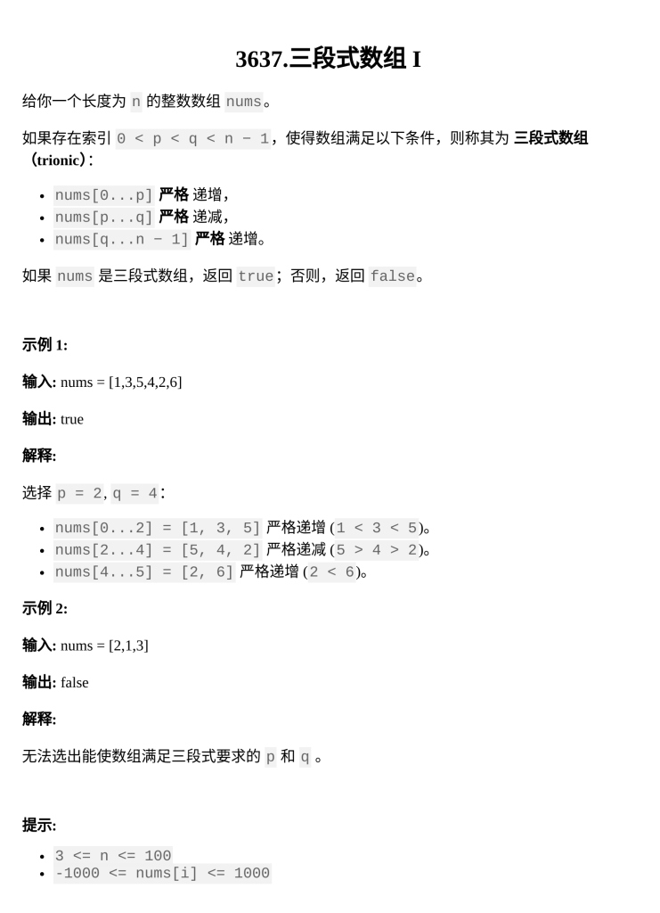

[三段式数组 I](https://leetcode.cn/problems/trionic-array-i/description/?envType=daily-question&envId=2026-02-03)

题目难度：Easy



模拟

时间复杂度 _O( n )_

```
class Solution {
public:
    bool isTrionic(vector<int>& nums) {
        int n=nums.size();
        int i=0;
        bool a=0,b=0,c=0;
        while(i+1<n&&nums[i+1]>nums[i]){
            a=1;
            i++;
        }
        while(i+1<n&&nums[i+1]<nums[i]){
            b=1;
            i++;
        }
        while(i+1<n&&nums[i+1]>nums[i]){
            c=1;
            i++;
        }
        return a&&b&&c&&i==n-1;
    }
};
```
