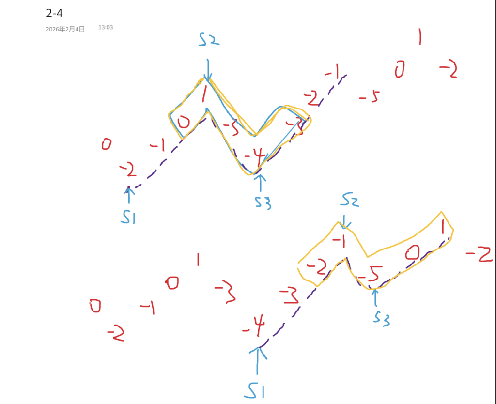

[三段式数组 II](https://leetcode.cn/problems/trionic-array-ii/description/?envType=daily-question&envId=2026-02-04)

题目难度：Hard


贪心



### 变量含义：

**_s1_** : 上升起点

**_s2_** : （上升终点）下降起点

**_s3_** : （下降终点）上升起点

### 答案组成：

**_s1 - s2_** ：最大后缀

**_s2 - s3_** ：全选

**_s3 ->_** ：最大前缀

### 实现细节：

以 **_s3_** 为起点的上升区间遍历完成后：让 **_s3_** 成为新的 **_s1_**

遇到重复元素：跳过，重新从 **_s1_** 开始

```
class Solution {
public:
    long long maxSumTrionic(vector<int>& nums) {
        int n,p,s1,s2,s3;
        long long ans,t;
        n=nums.size();
        ans=-1e18;
        p=0;
        while(p+1<n){
            t=-1e18;//收集累加和

            s1=p;
            while(p+1<n&&nums[p]<nums[p+1]){
                t=max(t+nums[p],(long long)nums[p]);//最大后缀
                p++;
            }
            if(s1==p){//处理重复元素
                p++;
                continue;
            }

            //从s2到s3全部收集
            s2=p;
            t+=nums[s2];
            while(p+1<n&&nums[p]>nums[p+1]){
                p++;
                t+=nums[p];
            }
            if(s2==p){//处理重复元素
                p++;
                continue;
            }

            //在第3段更新ans
            s3=p;
            while(p+1<n&&nums[p]<nums[p+1]){
                p++;
                t+=nums[p];
                ans=max(ans,t);
            }

            p=s3;//让s3成为新的s1
        }
        return ans;
    }
};
```
