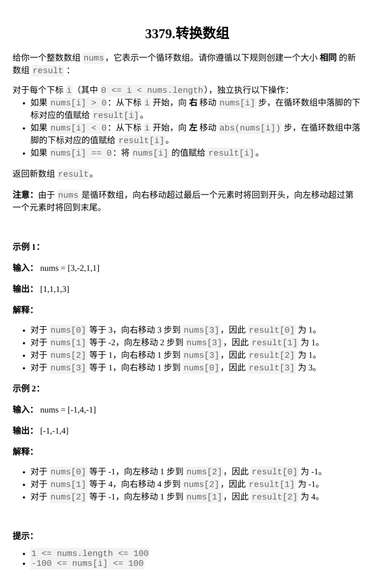

[转换数组](https://leetcode.cn/problems/transformed-array/description/?envType=daily-question&envId=2026-02-05)

题目难度：Easy



循环数组

```
class Solution {
public:
    vector<int> constructTransformedArray(vector<int>& nums) {
        int n=nums.size();
        vector<int>ans;
        for(int i=0;i<n;++i){
            if(nums[i]>0){
                ans.push_back(nums[(i+nums[i])%n]);
            }
            else if(nums[i]<0){
                ans.push_back(nums[(i+nums[i]%n+n)%n]);
            }
            else ans.push_back(0);
        }
        return ans;
    }
};
```
