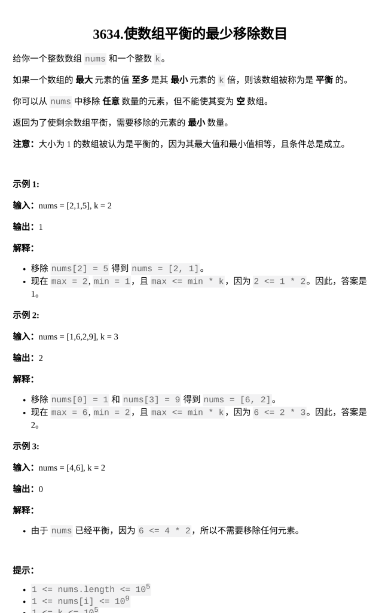

[使数组平衡的最少移除数目](https://leetcode.cn/problems/minimum-removals-to-balance-array/description/?envType=daily-question&envId=2026-02-06)

题目难度：Medium



排序 + 滑动窗口

枚举起点，不断向右推动终点

指针不会回退

时间复杂度： **_O(N)_**

```
class Solution {
public:
    int minRemoval(vector<int>& nums, int k) {
        ranges::sort(nums);
        int n=nums.size();
        int l=0,r=0;
        int M=0;
        while(r<n){
            while(r<n&&nums[r]<=(long)nums[l]*k)r++;
            M=max(M,r-l);
            l++;
        }
        return n-M;
    }
};
```
