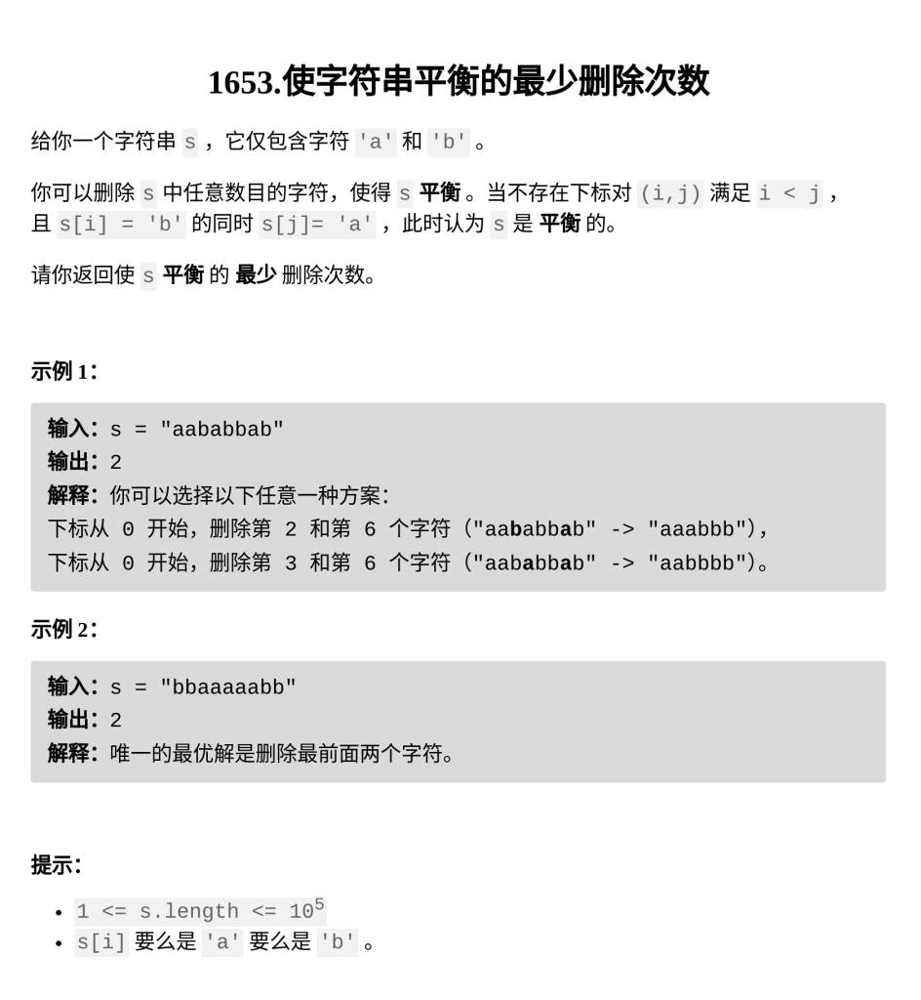

[使字符串平衡的最少删除次数](https://leetcode.cn/problems/minimum-deletions-to-make-string-balanced/description/?envType=daily-question&envId=2026-02-07)

题目难度：Medium



## 解法一、

预处理数组 **_A_**，**_B_**

**_A\[ i \]_**：**_\[ i , n-1 \]_** 中 **'a'** 的数量

**_B\[ i \]_**：**_\[ 0 , i \]_** 中 **'b'** 的数量

在 **_i_** 位置的答案为 **_A\[i\] + B\[i\] - 1_**

```
class Solution {
public:
    int minimumDeletions(string s) {
        int n=s.size();
        vector<int>A(n),B(n);
        int cnta=0,cntb=0;
        for(int i=n-1;i>=0;--i){
            if(s[i]=='a')cnta++;
            A[i]=cnta;
        }
        for(int i=0;i<n;++i){
            if(s[i]=='b')cntb++;
            B[i]=cntb;
        }
        int ans=A[0]+B[0]-1;
        for(int i=1;i<n;++i){
            ans=min(ans,A[i]+B[i]-1);
        }
        return ans;
    }
};
```

时间复杂度：_**`O(n)`**_

空间复杂度：**_`O(n)`_**

## 解法二、

动态规划

**dp(i)** 以 **i** 位置结尾的总代价

若 **s\[i\]** 为 **‘b’** ：

代价为 **0** ，**dp(i) = dp(i-1)**

若 **s\[i\]** 为 **‘a’** ：

删除**‘a’** ，代价为 **1** ，**dp(i) = 1 + dp(i-1)**

保留**‘a’** ，总代价为删除 **i** 左侧所有的 **'b'**

```
class Solution {
    string s;
    vector<int>cnt;
    int dp(int i){
        if(i<0)return 0;
        if(s[i]=='b')return dp(i-1);
        else return min(1+dp(i-1),cnt[i]);
    }
public:
    int minimumDeletions(string s) {
        this->s=s;
        int n=s.size();
        cnt.resize(n);
        cnt[0]=s[0]-'a';
        for(int i=1;i<n;++i){
            cnt[i]=cnt[i-1]+s[i]-'a';
        }
        return dp(n-1);
    }
};
```

时间复杂度：_**`O(n)`**_

空间复杂度：**_`O(n)`_**

相同的思路，更优雅的写法

```
class Solution {
public:
    int minimumDeletions(string s) {
        int cntb=0;
        int ans=0;
        for(char c:s){
            if(c=='b')cntb++;
            else ans=min(ans+1,cntb);
        }
        return ans;
    }
};
```

时间复杂度：_**`O(n)`**_

空间复杂度：**_`O(1)`_**
