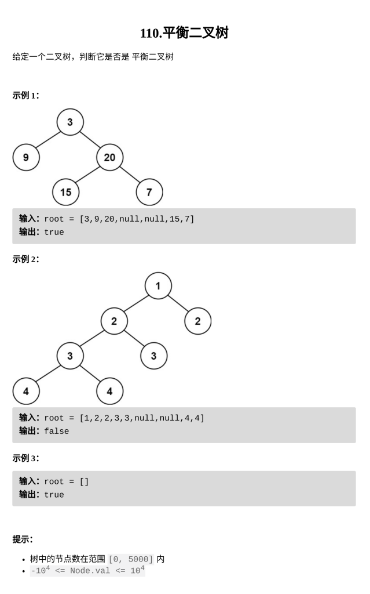

[平衡二叉树](https://leetcode.cn/problems/balanced-binary-tree/)

题目难度：Easy



后序遍历，计算子树深度

左子树深度：**L**

右子树深度：**R**

平衡二叉树：对每个结点 **_abs ( L - R ) <= 1_**

```
/**
 * Definition for a binary tree node.
 * struct TreeNode {
 *     int val;
 *     TreeNode *left;
 *     TreeNode *right;
 *     TreeNode() : val(0), left(nullptr), right(nullptr) {}
 *     TreeNode(int x) : val(x), left(nullptr), right(nullptr) {}
 *     TreeNode(int x, TreeNode *left, TreeNode *right) : val(x), left(left), right(right) {}
 * };
 */
class Solution {
    bool f;
    int dfs(TreeNode*root){
        if(root==nullptr){
            return 0;
        }
        int l=dfs(root->left);
        int r=dfs(root->right);
        if(abs(r-l)>1){
            f=0;
        }
        return 1+max(l,r);
    }
public:
    bool isBalanced(TreeNode* root) {
        f=1;
        dfs(root);
        return f;
    }
};
```
