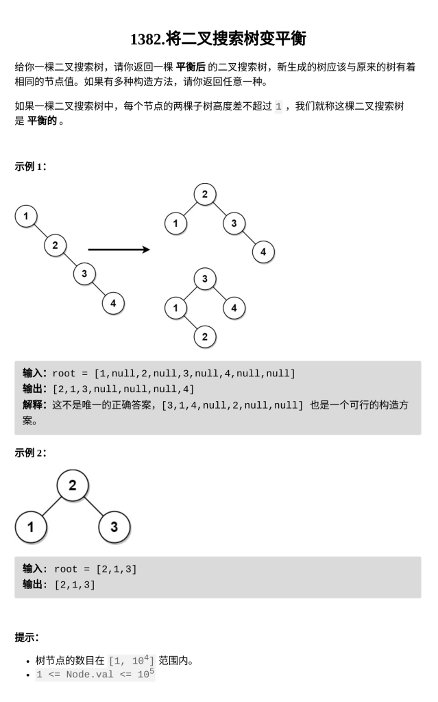

[将二叉搜索树变平衡](https://leetcode.cn/problems/balance-a-binary-search-tree/)

题目难度：Medium



二叉搜索树中序得到递增数组

二分递增数组构造平衡二叉搜索树

```
class Solution {
    vector<int>a;
    void dfs(TreeNode*root){
        if(root==nullptr)return;
        dfs(root->left);
        a.push_back(root->val);
        dfs(root->right);
    }
    TreeNode*dfs(int l,int r){
        if(l>r)return nullptr;
        int mid=(l+r)>>1;
        TreeNode*root=new TreeNode(a[mid]);
        root->left=dfs(l,mid-1);
        root->right=dfs(mid+1,r);
        return root;
    }
public:
    TreeNode* balanceBST(TreeNode* root) {
        dfs(root);
        return dfs(0,a.size()-1);
    }
};
```
