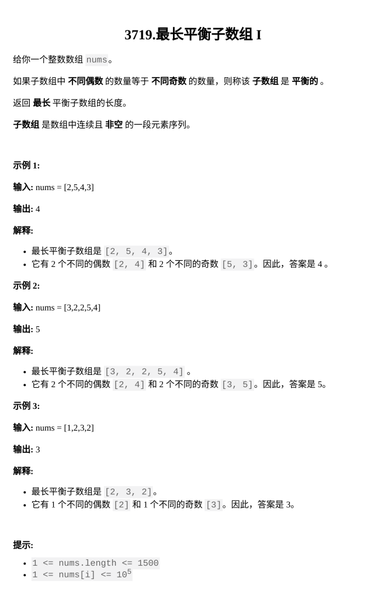

[最长平衡子数组 I](https://leetcode.cn/problems/longest-balanced-subarray-i/)

题目难度：Medium



数据范围比较小，枚举起点

用 set 去重，odd 与 eve 相等时更新答案

```
class Solution {
public:
    int longestBalanced(vector<int>& nums) {
        int n=nums.size();
        int ans=0;
        for(int l=0;l<n;++l){
            unordered_set<int>odd;
            unordered_set<int>eve;
            for(int r=l;r<n;++r){
                int in=nums[r];
                if(in&1){
                    odd.insert(in);
                }
                else{
                    eve.insert(in);
                }
                if(odd.size()==eve.size()){
                    ans=max(ans,r-l+1);
                }
            }
        }
        return ans;
    }
};
```
