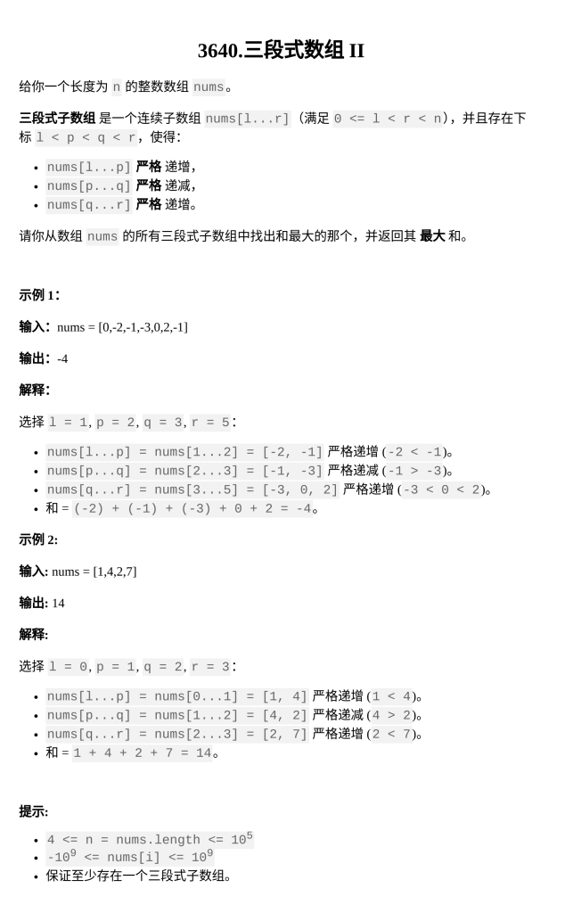

[最长平衡子数组 II](https://leetcode.cn/problems/longest-balanced-subarray-ii/?envType=daily-question&envId=2026-02-11)

题目难度：Hard



## 思路

当 **_x_** 第一次出现：

**_x_** 为奇数 ：**\-1**

**_x_** 为偶数：**1**

**_x_** 不是第一次出现：**0**

**区间奇偶平衡** 转化为 **区间和为0**

维护长为 **_n+1_** 的前缀和数组 **_presum_**

枚举区间的结束位置 **_R_** ，同时维护 **_\[ 0 , R ）_**的前缀和 **_cursum_**

枚举到 **_x = nums\[ R \]_** 时 ：

第一次出现：为了维护 **_presum_** 将**_\[ R , n )_** 都加上 **1 / -1**

再次出现：记录 **_x_** 上次出现的位置为 **_last_** ，将 **_last_** 之前的 **_\[ last , n )_** 区间加操作撤销，再对 **_\[ R , n )_** 都加上 **1 / -1**，相当于对 **_\[ last , R-1 )_** 都加上 **\-1 / 1**

在 **_R_** 之前查找 **_presum\[ L \] = cursum_**

查找成功更新答案 **_ans = max( ans , R-L )_**

用线段树实现 **_`O(logN)`_** 区间加

同时维护区间最大值最小值可以实现 **_`O(logN)`_** 查找

枚举结束位置 **_`O(N)`_**

总时间复杂度：**_`O(NlogN)`_**

```
class Solution {
    static const int N=1e5+5;
    int sum[N<<2];
    int add[N<<2];
    int Min[N<<2];
    int Max[N<<2];
    void up(int x){
        sum[x]=sum[x<<1]+sum[x<<1|1];
        Min[x]=min(Min[x<<1],Min[x<<1|1]);
        Max[x]=max(Max[x<<1],Max[x<<1|1]);
    }
    void built(int x,int l,int r){
        if(l==r){
            sum[x]=0;
            Min[x]=0;
            Max[x]=0;
        }
        else{
            int mid=(l+r)>>1;
            built(x<<1,l,mid);
            built(x<<1|1,mid+1,r);
            up(x);
        }
        add[x]=0;
    }
    void lazy_add(int x,int k,int siz){
        sum[x]+=k*siz;
        add[x]+=k;
        Max[x]+=k;
        Min[x]+=k;
    }
    void down(int x,int ln,int rn){
        if(add[x]){
            lazy_add(x<<1,add[x],ln);
            lazy_add(x<<1|1,add[x],rn);
            add[x]=0;
        }
    }
    void ADD(int x,int l,int r,int ql,int qr,int k){
        if(ql<=l&&r<=qr){
            lazy_add(x,k,r-l+1);
            return;
        }
        int mid=(l+r)>>1;
        down(x,mid-l+1,r-mid);
        if(ql<=mid)ADD(x<<1,l,mid,ql,qr,k);
        if(qr>mid)ADD(x<<1|1,mid+1,r,ql,qr,k);
        up(x);
    }
    int find(int x,int l,int r,int ql,int qr,int tar){
        if(l>qr||r<ql||tar<Min[x]||tar>Max[x]){
            return -1;
        }
        if(l==r)return l;
        int mid=(l+r)>>1;
        down(x,mid-l+1,r-mid);
        int ans=find(x<<1,l,mid,ql,qr,tar);
        if(ans==-1)ans=find(x<<1|1,mid+1,r,ql,qr,tar);
        return ans;
    }
public:
    int longestBalanced(vector<int>& nums) {
        int n=nums.size();
        built(1,0,n);
        unordered_map<int,int>st;
        int ans=0;
        int cur=0;
        for(int r=1;r<=n;++r){
            int x=nums[r-1];
            int v=x&1?-1:1;
            if(st.count(x)){
                int last=st[x];
                ADD(1,0,n-1,last,r-1,-v);
            }
            else{
                cur+=v;
                ADD(1,0,n-1,r,n-1,v);
            }
            st[x]=r;
            int l=find(1,0,n-1,0,r,cur);
            if(l!=-1)ans=max(ans,r-l);
        }
        return ans;
    }
};
```
