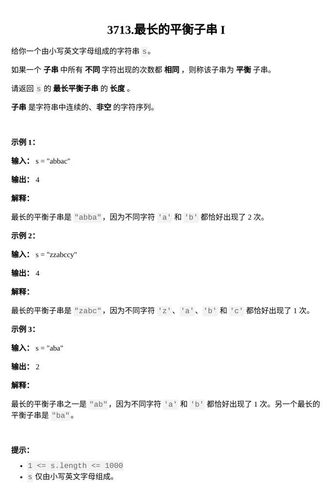

[最长的平衡子串 I](https://leetcode.cn/problems/longest-balanced-substring-i/description/https://leetcode.cn/problems/longest-balanced-substring-i/description/)

题目难度：Medium



数据范围较小

枚举 + 记数

只有小写字母，检查平衡的代价可以看作常数

时间复杂度：

O(N2)O(N^2)

```
class Solution {
public:
    int longestBalanced(string s) {
        int n=s.size();
        int ans=1;
        for(int i=0;i+1<n;++i){
            unordered_map<char,int>cnt;
            cnt[s[i]]++;
            for(int j=i+1;j<n;++j){
                int t=++cnt[s[j]];
                bool ok=1;
                for(auto [_,x]:cnt){
                    if(x!=t){
                        ok=0;
                        break;
                    }
                }
                if(ok){
                    ans=max(ans,j-i+1);
                }
            }
        }
        return ans;
    }
};
```
