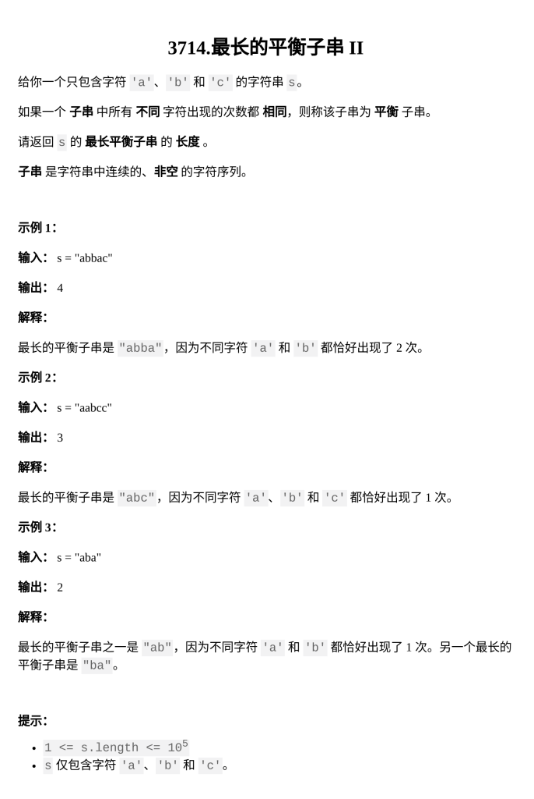

[最长的平衡子串 II](https://leetcode.cn/problems/longest-balanced-substring-ii/description/)  
题目难度：Medium



枚举答案可能性

子串只有一个元素组成

子串只有两个元素组成，哈希 **1** ， **\-1** ，维护前缀和

子串只有三个元素组成，哈希 `**_n<=1e5_**` ： **1** ， **100000** ， **\-100001**，维护前缀和

```
class Solution {
    string s;
    int n;
    int f1(){
        int ans=0;
        int i=0;
        while(i<n){
            int j=i;
            while(j<n&&s[i]==s[j])j++;
            ans=max(ans,j-i);
            i=j;
        }
        return ans;
    }
    int f2(){
        return max({f2('a','b'),f2('c','b'),f2('a','c')});
    }
    int f2(char a,char b){
        int ans=0;
        int i=0;
        while(i<n){
            int j=i;
            unordered_map<int,int>L;
            L[0]=i-1;
            int cur=0;
            while(j<n&&(s[j]==a||s[j]==b)){
                cur+=s[j]==a?1:-1;
                if(L.count(cur)){
                    ans=max(ans,j-L[cur]);
                }
                else{
                    L[cur]=j;
                }
                j++;
            }
            i=j;
            i++;
        }
        return ans;
    }
    int f3(){
        unordered_map<long long,int>L;
        L[0]=0;
        int ans=0;
        long long cur=0;
        for(int i=1;i<=n;++i){
            cur+=s[i-1]=='a'?1:(s[i-1]=='b'?100000:-100001);
            if(L.count(cur)){
                ans=max(ans,i-L[cur]);
            }
            else L[cur]=i;
        }
        return ans;
    }
public:
    int longestBalanced(string s) {
        this->s=s;
        this->n=s.size();
        return max({f1(),f2(),f3()});
    }
};
```
