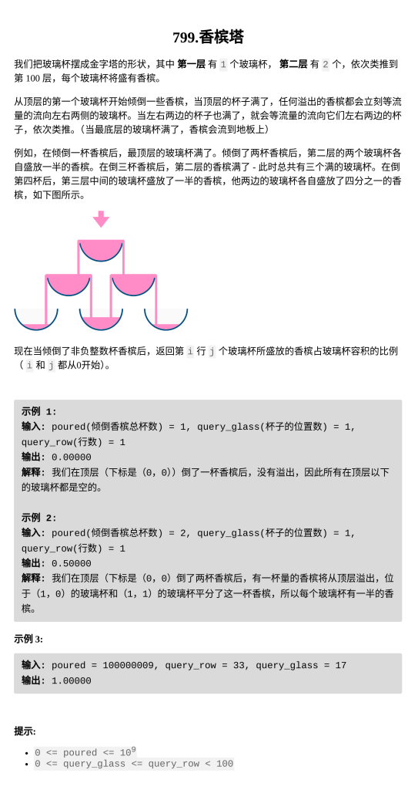

[香槟塔](http://获取今日每日一题成功~加油哦ww 799.香槟塔 题目难度：Medium  本题链接：https://leetcode.cn/problems/champagne-tower/)

题目难度：Medium



模拟

最初所有水都在**（0，0）**

**（i，j）**的水如果 **大于1**，多余的水会平均流到**（i+1，j）**和**（i+1，j+1）**

将这个往下流的操作从 **第 _1_ 层** 模拟到 **第 _query\_row_ 层**

答案为 **第 _query\_row_ 层** 的 **第 _k_ 杯**

```
class Solution {
public:
    double champagneTower(int poured, int row, int k) {
        vector<double>f(row+1);
        f[0]=poured;
        for(int i=0;i<row;++i){
            for(int j=i;j>=0;--j){
                double re=f[j]-1;
                f[j]=0;
                if(re>0){
                    f[j+1]+=re/2;
                    f[j]+=re/2;
                }
            }
        }
        return f[k]>1?1:f[k];
    }
};
```
