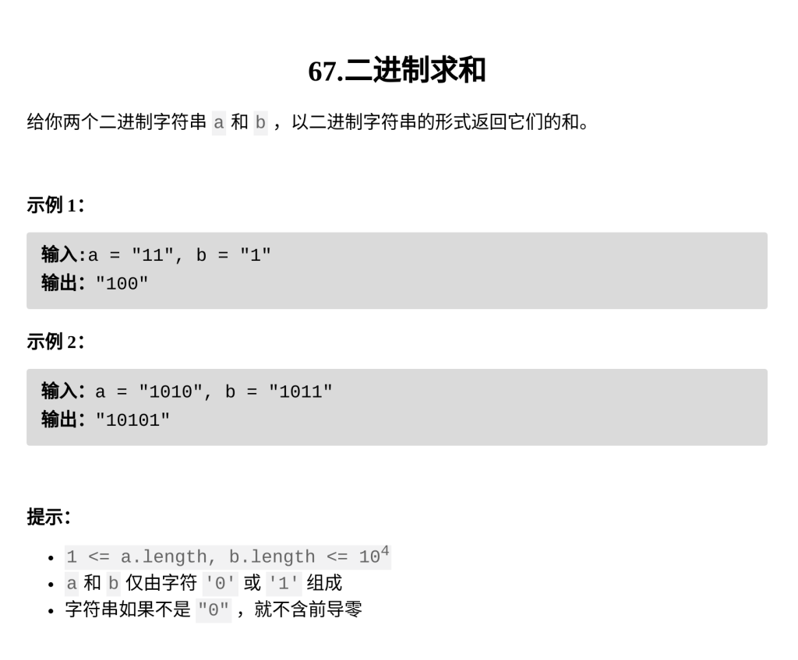

[二进制求和](https://leetcode.cn/problems/add-binary/description/?envType=daily-question&envId=2026-02-15)

题目难度：Easy



翻转，模拟进位

```
class Solution {
public:
    string addBinary(string a, string b) {
        reverse(a.begin(),a.end());
        reverse(b.begin(),b.end());
        int n=a.size();
        int m=b.size();
        string ans="";
        int carry=0;
        for(int i=0;i<max(n,m);++i){
            int x=i<n?a[i]-'0':0;
            int y=i<m?b[i]-'0':0;
            int sum=x+y+carry;
            carry=sum/2;
            ans+=sum%2+'0';
        }
        reverse(ans.begin(),ans.end());
        if(carry)return '1'+ans;
        return ans;
    }
};
```
