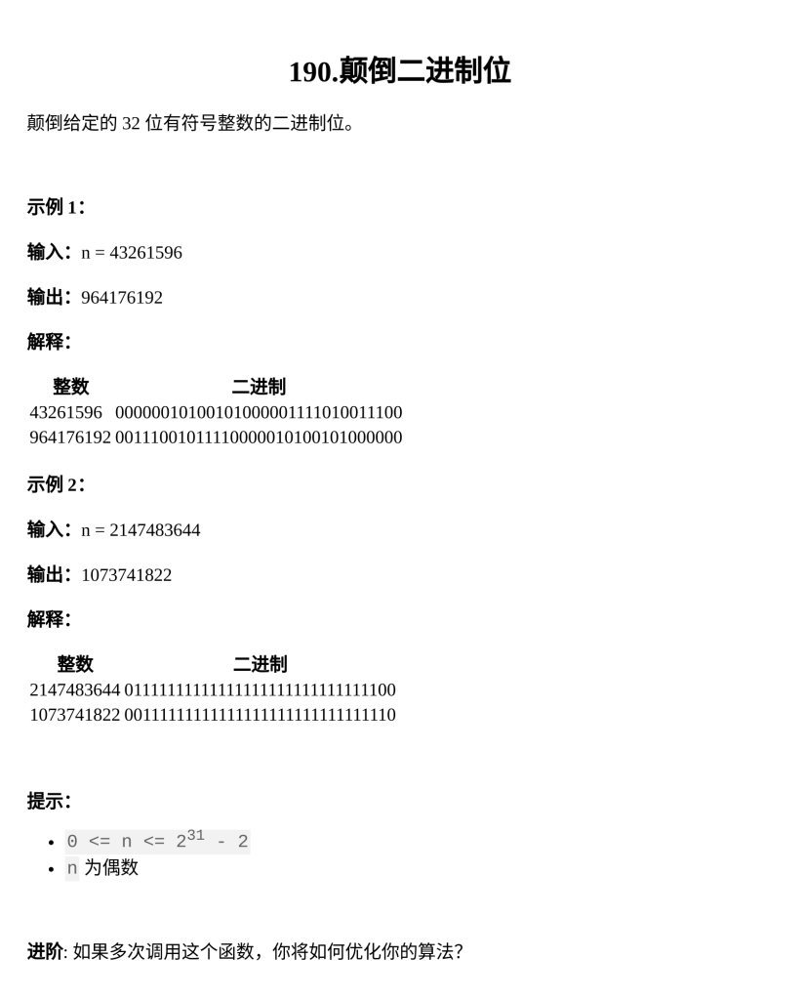

[颠倒二进制位](https://leetcode.cn/problems/reverse-bits/)

题目难度：Easy



**模拟**

```
class Solution {
public:
    int reverseBits(int n) {
        int ans=0;
        for(int i=0;i<32;++i){
            ans=(ans<<1)+n%2;
            n>>=1;
        }
        return ans;
    }
};
```

**库函数**

```
class Solution {
public:
    int reverseBits(int n) {
        return __builtin_bitreverse32(n);
    }
};
```
