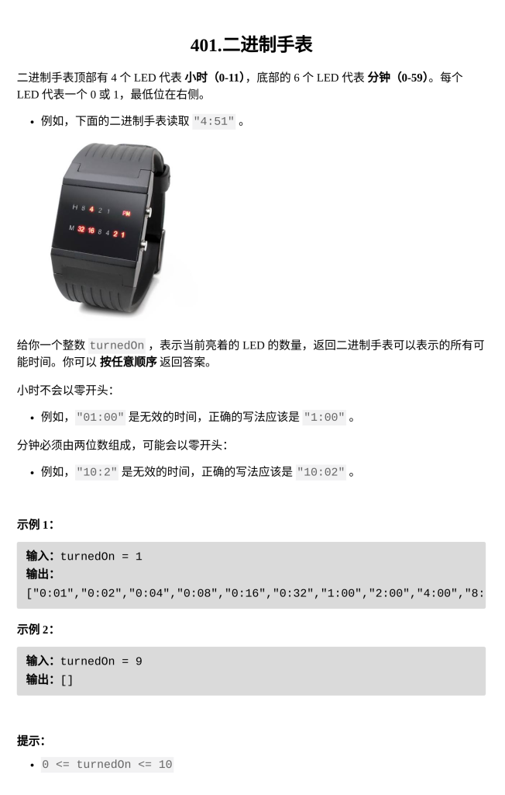

[二进制手表](https://leetcode.cn/problems/binary-watch/?envType=daily-question&envId=2026-02-17)

题目难度：Easy



**枚举 + 二进制**

```
class Solution {
    int cnt(int x){
        int res=0;
        while(x){
            if(x&1)res++;
            x>>=1;
        }
        return res;
    }
public:
    vector<string> readBinaryWatch(int turnedOn) {
        vector<string>ans;
        for(int h=0;h<12;++h){
            for(int m=00;m<60;++m){
                if(cnt(h)+cnt(m)==turnedOn){
                    ans.push_back(to_string(h)+(m<10?":0":":")+to_string(m));
                }
            }
        }
        return ans;
    }
};
```
