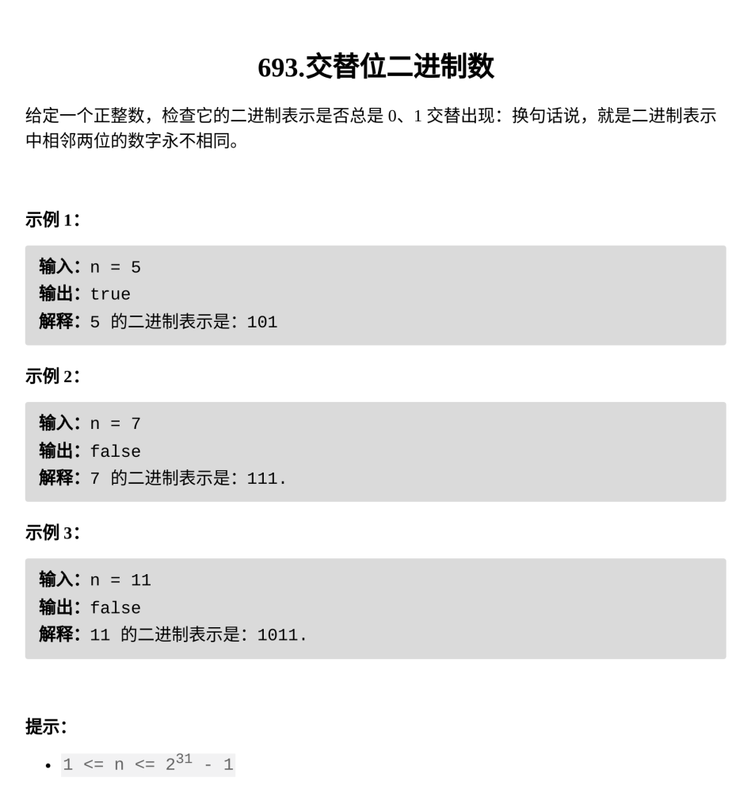

[交替位二进制数](https://leetcode.cn/problems/binary-number-with-alternating-bits/)

题目难度：Easy



```
class Solution {
public:
    bool hasAlternatingBits(int n) {
        bool f=1;
        int x=n&1;
        n>>=1;
        while(n){
            int t=n&1;
            if(x==t)return 0;
            x=t;
            n>>=1;
        }
        return 1;
    }
};
```
