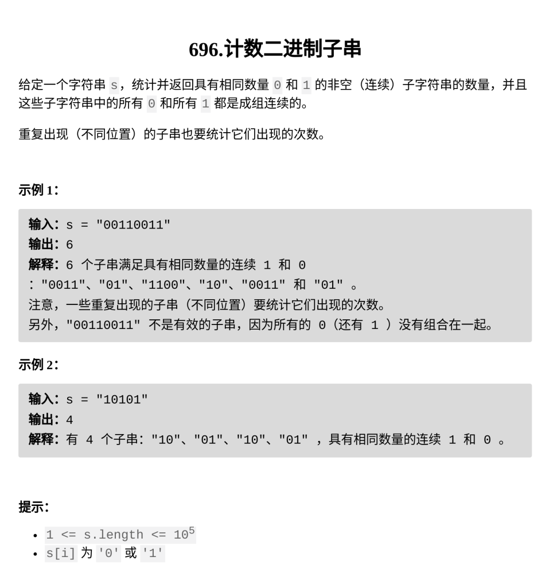

[计数二进制子串](https://leetcode.cn/problems/count-binary-substrings/description/?envType=daily-question&envId=2026-02-19)

题目难度：Easy



**模拟**

```
class Solution {
public:
    int countBinarySubstrings(string s) {
        vector<int>a;
        int n=s.size();
        int i=0;
        while(i<n){
            int j=i;
            while(j+1<n&&s[j+1]==s[j])j++;
            a.push_back(j-i+1);
            i=j+1;
        }
        int ans=0;
        for(int i=1;i<a.size();++i){
            ans+=min(a[i-1],a[i]);
        }
        return ans;
    }
};
```
