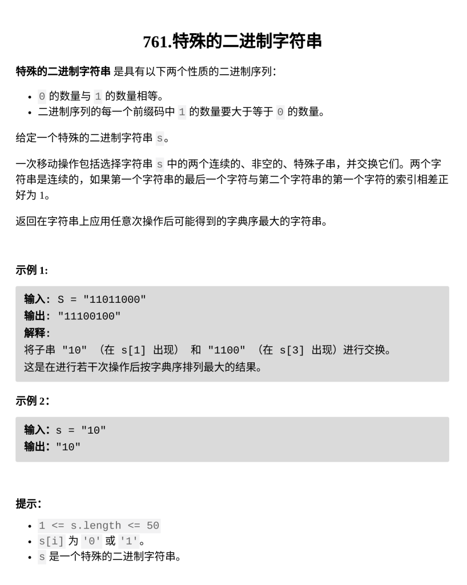

[特殊的二进制字符串](https://leetcode.cn/problems/special-binary-string/)

题目难度：Hard



**括号匹配**

**1** 看作左括号，**0** 看作右括号

括号匹配成功将自动满足：

1. 左括号数量等于右括号数量

3. 对于每一个前缀，左括号数量大于等于右括号数量

对于每个 **( )** 外部：

**10 1100 11011000**

看作对 **() (()) (()(()))** 排序得到 **(()(())) (()) ()**

**11011000 1100 10**

对于每个 ( ) 内部：

**11011000**

去掉最外侧的一层括号，看作规模更小的子问题

递归处理 **10 1100**

将 **() (())** 排序得到 **(()) ()**

**1100 10**

最终得到 **10110011011000 _\->_ 11100100110010**

```
class Solution {
public:
    string makeLargestSpecial(string s) {
        if(s.size()<=2){
            return s;
        }
        vector<string>subs;
        int cnt=0;
        int l=0;
        for(int r=l;r<(int)s.size();++r){
            if(s[r]=='1'){
                cnt++;
            }
            else if(--cnt==0){
                subs.push_back("1"+makeLargestSpecial(s.substr(l+1,r-l+1-2))+"0");
                l=r+1;
            }
        }
        ranges::sort(subs,greater());
        string ans="";
        for(string sub:subs)ans+=sub;
        return ans;
    }
};
```
