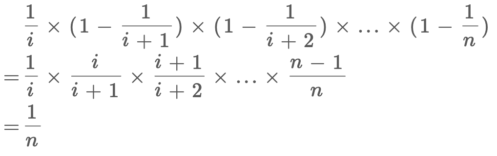

## 洗牌算法

**打乱一个数组**：

数组有 **n** 个元素，共有 **n!** 种排列，要求随机（等概率）获取其中一种排列

```
template<typename T>
void suff(vector<T>&arr){
    int n=arr.size();
    for(int i=0;i<n-1;++i){
        swap(arr[i],arr[i+rand()%(n-i)]);
    }
}
```

**证明：**

- 对于 `**_arr[0]_**` 我们将它等概率地放到了 `**_[0,n)_**` 上，共有 `**n**` 可能

- 对于  **_`arr[1]`_** 我们将它等概率地放到了 `**_[1,n)_**` 上，共有 `**n-1**` 可能

- 对于  **_`arr[2]`_** 我们将它等概率地放到了 `**_[2,n)_**` 上，共有 `**n-2**` 可能

- …………

- 对于  `**_arr[n-2]_**`  我们将它等概率地放到了 `**_[n-2,n)_**` 上，共有 **`2`** 可能

- 对于  `**_arr[n-1]_**`  我们将它放到了 `**_[n-1,n)_**` 上，只有 `**1**` 种可能

累乘得到一共有  **`n!`** 种可能

**变式 - 随机分布**

将 **k** 个元素随机分布进一个 长度为 **n** 的数组

将 **k** 个元素放至最前面，打乱数组

## 水塘抽样算法

**一个未知长度的链表，只遍历一次，随机获取（等概率）其中一个元素**

```
struct ListNode{
    int val;
    ListNode*next;
};

int getRandom(ListNode*head){
    int ans;
    int i=0;
    ListNode*p=head;
    while(p){
        i++;
        if(rand()%i==0){
            ans=p->val;
        }
        p=p->next;
    }
    return ans;
}
```

**证明：**

`rand()%i` 得到一个 **_\[ 0 , i )_** 的数，等于 **0** 的概率为 **_1 / i_**

`rand()%i==0` 为真的概率为 **_1 / i_**

对于第 **i** 个数，它被选为 **ans** 必须满足

1. 轮到它的时候，它被选上了  **_1 / i_**

3. 第 **i** 个数后面的所有数都没有被选上

**ans** 可以被覆盖，所以前面的选择对后面的选择没有影响

那么第 **i** 个数被选为 **ans** 的概率为:



**变式 - 随机获取 _k_ 个元素**

**一个未知长度的链表，只遍历一次，随机获取（等概率）其中 _k_ 个元素**

轮到第 **i** 个元素时：以 **k / i** 的概率将其选进 **ans**

```
vector<int> getRandom(ListNode*head,int k){
    vector<int>ans(k);
    int i=0;
    ListNode*p=head;
    while(p){
        i++;
        int j=rand()%i;
        if(j<k){
            ans[j]=p->val;
        }
        p=p->next;
    }
    return ans;
}
```

## [带权随机](https://leetcode.cn/problems/random-pick-with-weight/description/)

一个长度为 **n** 的正整数数组 **w** ，其中 **_w\[ i \]_** 代表第 **i** 个下标的权重

选中下标 **i** 对应元素的概率为 **_w\[ i \]/ sum(w)_**

**前缀和 + 二分**

生成一个 **\[ 0 , sum(w) )** 的随机数 **k**

在前缀和数组中查找第一个大于 **k** 的下标

```
class Solution {
    int n;
    vector<int>presum;
public:
    Solution(vector<int>& w) {
        n=w.size();
        presum.resize(n+1);
        for(int i=0;i<n;++i){
            presum[i+1]=presum[i]+w[i];
        }
    }
    int pickIndex() {
        int k=rand()%presum[n];
        int l=0,r=n-1,mid,ans;
        while(r>=l){
            mid=(l+r)>>1;
            if(presum[mid+1]>k){
                ans=mid,r=mid-1;
            }
            else l=mid+1;
        }
        return ans;
    }
};
```
