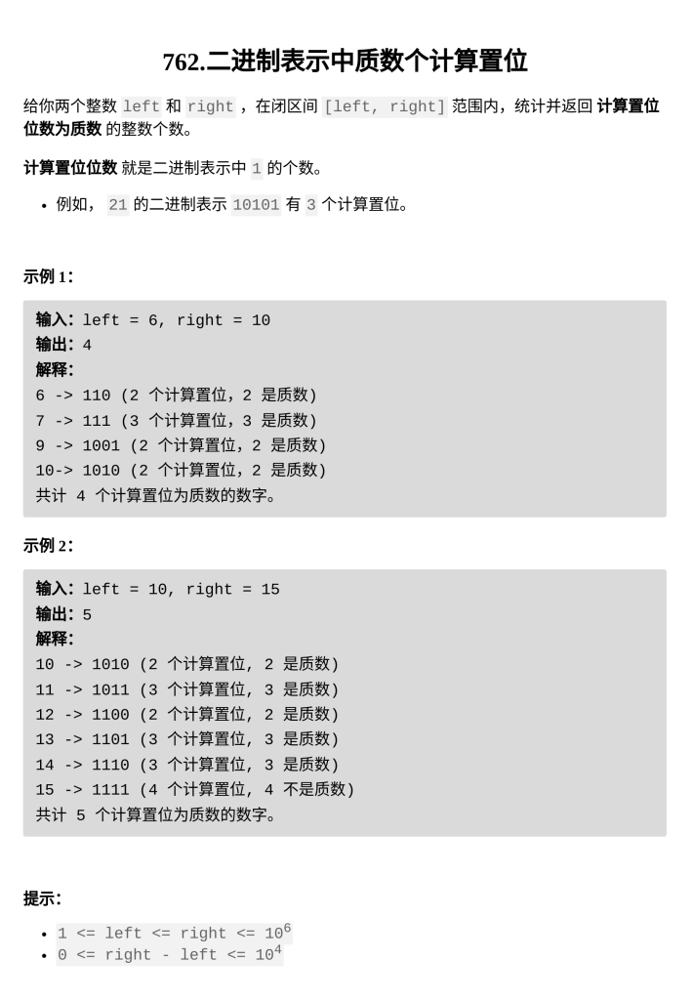

[二进制表示中质数个计算置位](https://leetcode.cn/problems/prime-number-of-set-bits-in-binary-representation/)

题目难度：Easy



**模拟**

```
class Solution {
public:
    int countPrimeSetBits(int l, int r) {
        auto isp=[](int x)->bool{
            if(x==1)return 0;
            for(int i=2;i*i<=x;++i){
                if(x%i==0)return 0;
            }
            return 1;
        };
        auto cnt=[](int x)->int{
            int t=0;
            while(x){
                if(x&1)t++;
                x>>=1;
            }
            return t;
        };
        int ans=0;
        for(int i=l;i<=r;++i){
            if(isp(cnt(i)))ans++;
        }
        return ans;
    }
};
```
