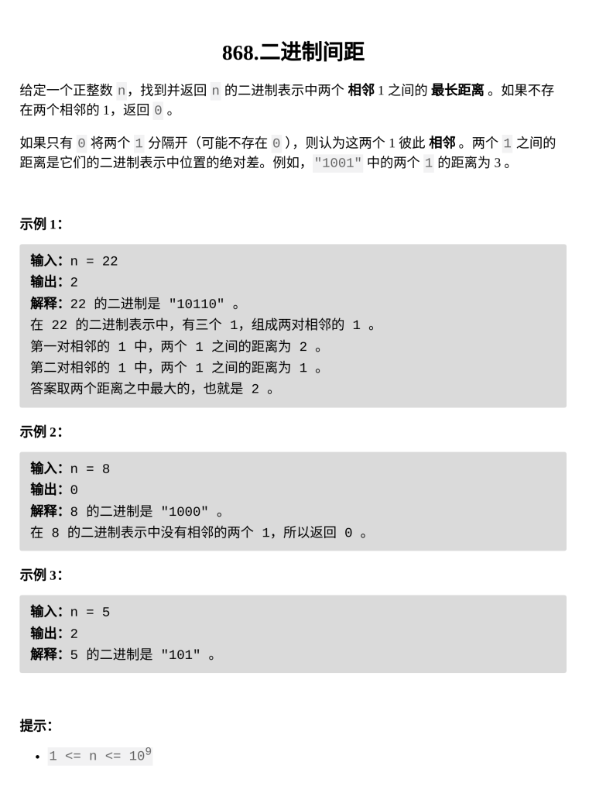

二进制间距

题目难度：Easy



**模拟**

```
class Solution {
public:
    int binaryGap(int n) {
        int ans=0;
        int cnt=0;
        while(n){
            if(n&1){
                if(cnt==0)cnt++;
                else{
                    ans=max(ans,cnt);
                    cnt=1;
                }
            }
            else{
                if(cnt)cnt++;
            }
            n>>=1;
        }
        return ans;
    }
};
```
