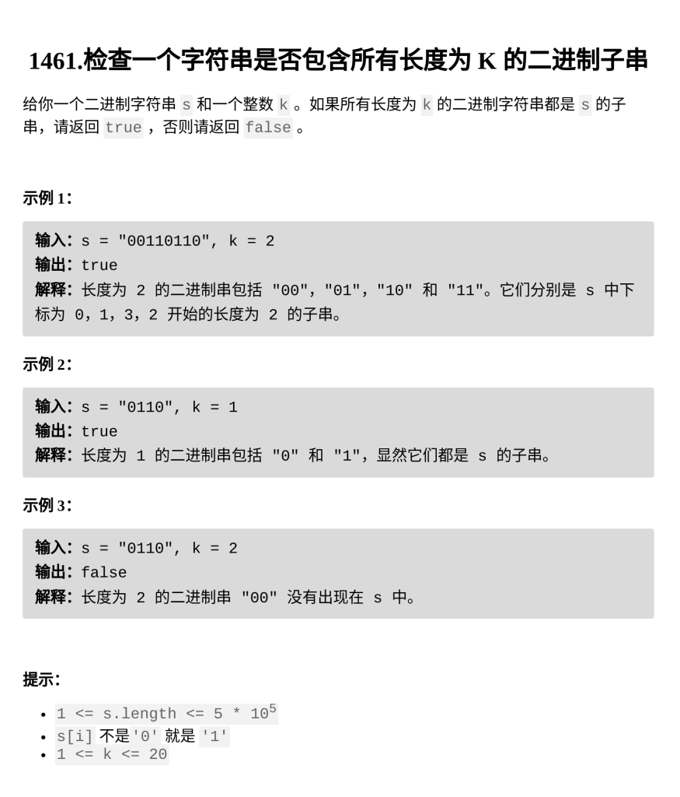

[检查一个字符串是否包含所有长度为 K 的二进制子串](https://leetcode.cn/problems/check-if-a-string-contains-all-binary-codes-of-size-k/?envType=daily-question&envId=2026-02-23)

题目难度：Medium



暴力统计 **s** 所有长度为 **k** 的子串

```
class Solution {
public:
    bool hasAllCodes(string s, int k) {
        unordered_set<string>cnt;
        for(int i=0;i+k<=s.size();++i){
            cnt.insert(s.substr(i,k));
        }
        return cnt.size()==(1<<k);
    }
};
```
