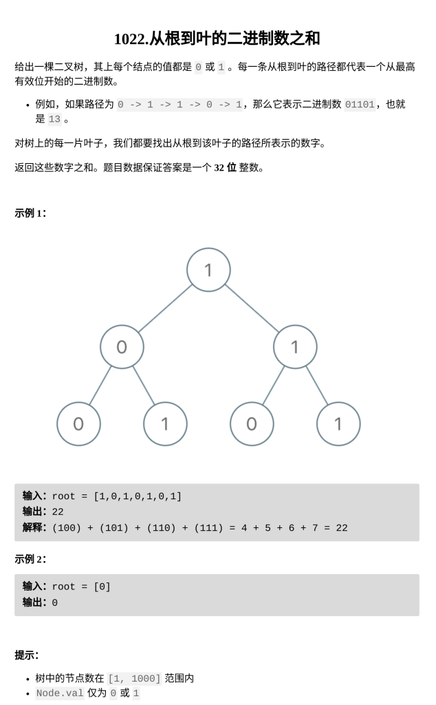

从根到叶的二进制数之和

题目难度：Easy



**DFS**

```
class Solution {
    int ans,path;
public:
    int sumRootToLeaf(TreeNode* root) {
        ans=path=0;
        dfs(root);
        return ans;
    }
    void dfs(TreeNode*root){
        if(root==nullptr)return;
        if(root->left==nullptr&&root->right==nullptr){
            path=(path<<1)|root->val;
            ans+=path;
            path>>=1;
        }
        path=(path<<1)|root->val;
        dfs(root->left);
        dfs(root->right);
        path>>=1;
    }
};
```
