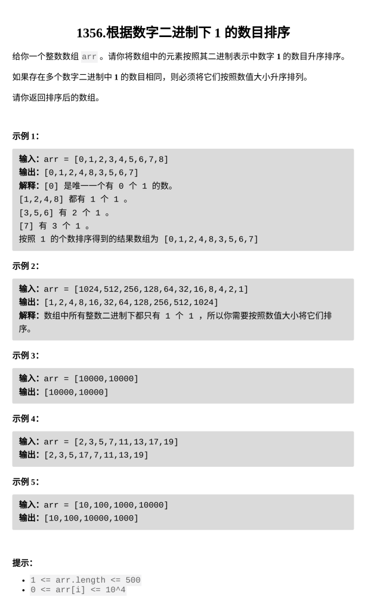

[根据数字二进制下 1 的数目排序](https://leetcode.cn/problems/sort-integers-by-the-number-of-1-bits/)

题目难度：Easy



**排序**

```
class Solution {
public:
    vector<int> sortByBits(vector<int>& arr) {
        sort(arr.begin(),arr.end(),[](int a,int b){
            int A=__builtin_popcount(a);
            int B=__builtin_popcount(b);
            if(A!=B)return A<B;
            return a<b;
        });
        return arr;
    }
};
```
