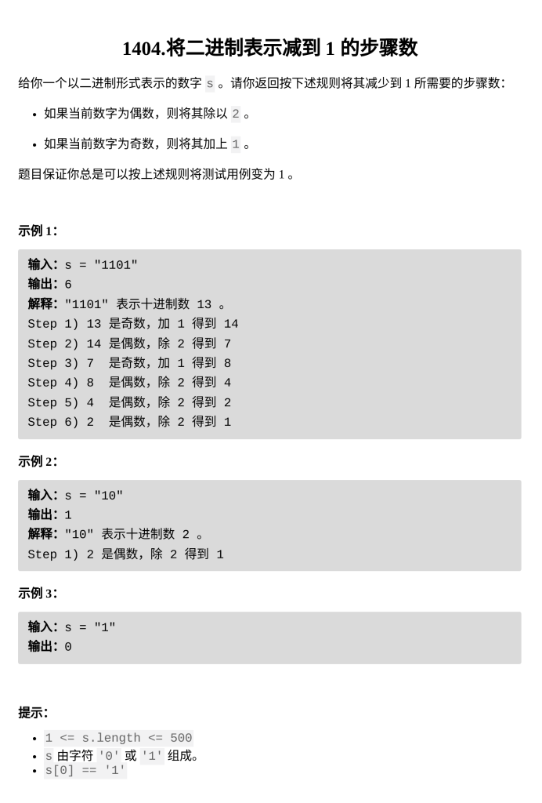

[将二进制表示减到 1 的步骤数](https://leetcode.cn/problems/number-of-steps-to-reduce-a-number-in-binary-representation-to-one/?envType=daily-question&envId=2026-02-26)

题目难度：Medium



**模拟**

```
class Solution {
public:
    int numSteps(string s) {
        int ans=0;
        int carry=0;
        for(int i=s.size()-1;i;--i){
            ans++;
            int sum=s[i]-'0'+carry;
            if(sum&1){
                carry=(sum+1)/2;
                ans++;
            }
            else{
                carry=sum/2;
            }
        }
        return ans+carry;
    }
};
```
