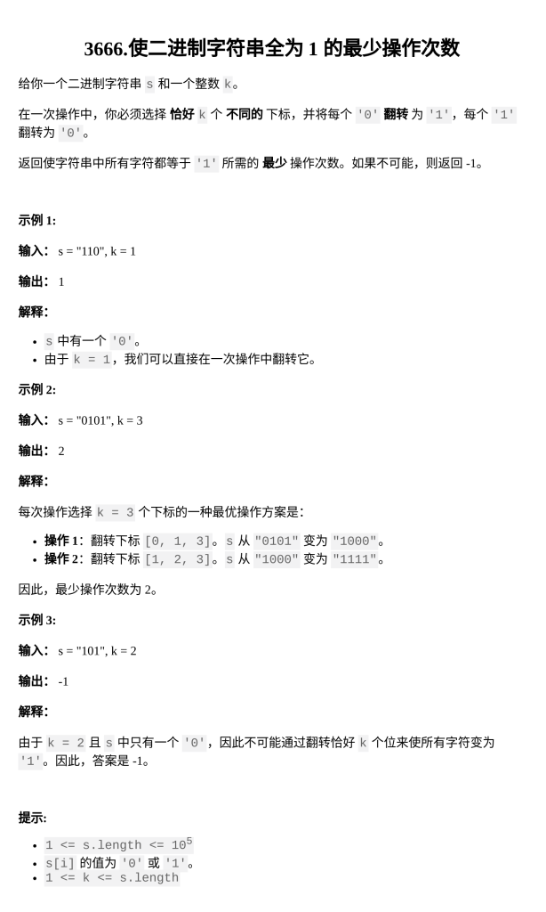

[使二进制字符串全为 1 的最少操作次数](https://leetcode.cn/problems/minimum-operations-to-equalize-binary-string/description/?envType=daily-question&envId=2026-02-27)

题目难度：Hard



**BFS + 有序表**

只关注当前有多少个 **0**

**建图**

假设当前有 **u 个 0**，则有 **n-u 个 1**

若 **_u >= k_**：全选 **0**，最少可以剩下 **u-k 个 0**

若 _**u < k**_：选 **u** 个 **0**，**k-u** 个 **1**，最少可以剩下 **k-u 个 0**

若 _**n-u >= k**_ ：全选 **1**，最多可以剩下 **u+k 个** 0

若 **_n-u < k_** ：选 **n-u** 个 **0**，**k-(n-u)** 个 **1**，最多可以剩下 **n-(k-(n-u)) 个 0**

**有序表优化**

每少选一个 **0** ，就要多选一个 **1**，对 **u** 的影响相差 **2**

对当前的 **u**，可以到达 **v** ：

**u ,v** 奇偶性相同，而且是连续的

到达过的点直接从有序表中删除

**_`O(N^2)`_** 优化为 **_`O(NlogN)`_**

```
class Solution {
public:
    int minOperations(string s, int k) {
        int cnt=0;
        for(char c:s)if(c=='0'){
            cnt++;
        }
        int n=s.size();
        set<int>st[2];
        for(int i=0;i<=n;++i)if(i!=cnt){
            st[i&1].insert(i);
        }
        st[0].insert(n+1);
        st[1].insert(n+1);
        vector<int>dis(n+1,-1);
        dis[cnt]=0;
        queue<int>q;
        q.push(cnt);
        while(q.size()){
            int u=q.front();
            q.pop();
            int L=u>=k?u-k:k-u;
            int R=u+k<=n?u+k:2*n-u-k;
            for(auto it=st[L&1].lower_bound(L);*it<=R;it=st[L&1].erase(it)){
                dis[*it]=dis[u]+1;
                q.push(*it);
            }
        }
        return dis[0];
    }
};
```
