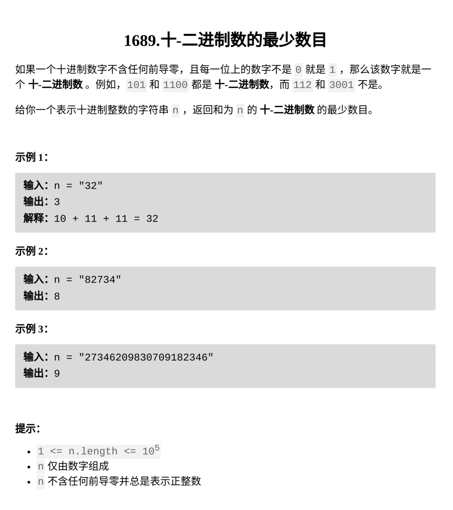

十-二进制数的最少数目

题目难度：Medium



**脑筋急转弯**

每一个二进制串可以无限长

对于十进制串的每一位 i ，至少需要 i 个二进制串在此位上为 1

```
class Solution {
public:
    int minPartitions(string n) {
        return ranges::max(n)-'0';
    }
};
```
