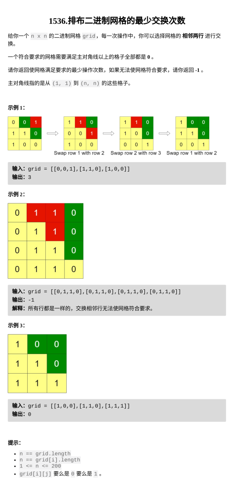

[排布二进制网格的最少交换次数](https://leetcode.cn/problems/minimum-swaps-to-arrange-a-binary-grid/description/?envType=daily-question&envId=2026-03-02)

题目难度：Medium



**模拟 + 冒泡排序**

处理 **_`cnt[i]`_**：第 i 行末尾 0 的数量

在 _`**cnt[]**`_ 上冒泡排序

从上到下，对第 **i** 行：

找到 **i** 下方最近的满足条件的一行 **j**

将 **j** ”冒泡"至 **i** 位置

```
class Solution {
public:
    int minSwaps(vector<vector<int>>&g) {
        int n=g.size();
        vector<int>cnt(n);
        for(int i=0;i<n;++i){
            for(int j=n-1;j>=0;--j){
                if(g[i][j]){
                    cnt[i]=n-j-1;
                    break;
                }
                else if(j==0){
                    cnt[i]=n;
                }
            }
        }
        int ans=0;
        for(int i=0;i<n-1;++i){
            int j=i;
            while(j<n&&cnt[j]<n-i-1){
                j++;
            }
            if(j==n){
                return -1;
            }
            for(;j>i;--j){
                swap(cnt[j],cnt[j-1]);
                ans++;
            }
        }
        return ans;
    }
};
```
