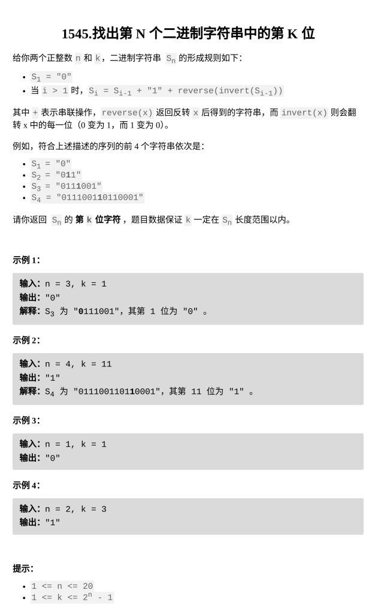

[找出第 N 个二进制字符串中的第 K 位](https://leetcode.cn/problems/find-kth-bit-in-nth-binary-string/description/?envType=daily-question&envId=2026-03-03)

题目难度：Medium



**递归**

**Si** 的长度为 **2^i -1** ，**第 1 位**一定是 **0**，**最中间**一定是 **1**

当 **k** 等于 **1** 或者 **mid** 时，直接返回 **0** 或 **1**

当 **k < mid** 时，向左半边递归查找第 **k** 位

当 **k > mid** 时，向右侧查找：

**k** 超出当前中线：**k - mid**

右侧是由左侧翻转得到的：

右侧的第 **k - mid** 位就是左侧的倒着数第 **k - mid** 位

也就是左侧的正着数第 **mid - ( k - mid)** 位

左侧翻转到右侧还需进行 **_`invert()`_** 操作：异或 **1** 即可

```
class Solution {
public:
    char findKthBit(int n, int k) {
        if(k==1){
            return '0';
        }
        int mid=1<<(n-1);
        if(k==mid){
            return '1';
        }
        if(k<mid){
            return findKthBit(n-1,k);
        }
        return 1^findKthBit(n-1,mid-(k-mid));
    }
};
```
