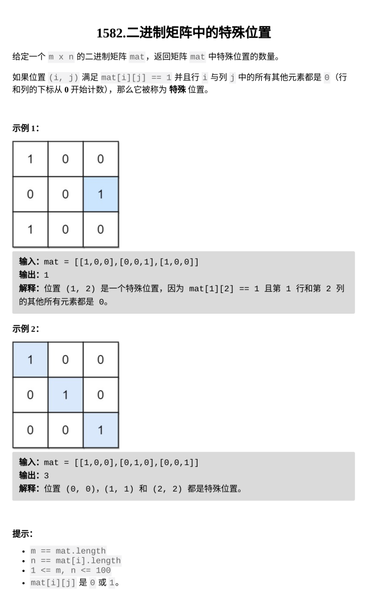

[二进制矩阵中的特殊位置](https://leetcode.cn/problems/special-positions-in-a-binary-matrix/description/?envType=daily-question&envId=2026-03-04)

题目难度：Easy



**枚举**

```
class Solution {
public:
    int numSpecial(vector<vector<int>>& M) {
        int n=M.size();
        int m=M[0].size();
        function<bool(int,int)>
        check=[&](int x,int y)->bool{
            for(int i=0;i<n;++i){
                if(i!=x&&M[i][y]){
                    return 0;
                }
            }
            for(int j=0;j<m;++j){
                if(j!=y&&M[x][j]){
                    return 0;
                }
            }
            return 1;
        };
        int ans=0;
        for(int i=0;i<n;++i){
            for(int j=0;j<m;++j){
                if(M[i][j]){
                    if(check(i,j)){
                        ans++;
                    }
                }
            }
        }
        return ans;
    }
};
```
