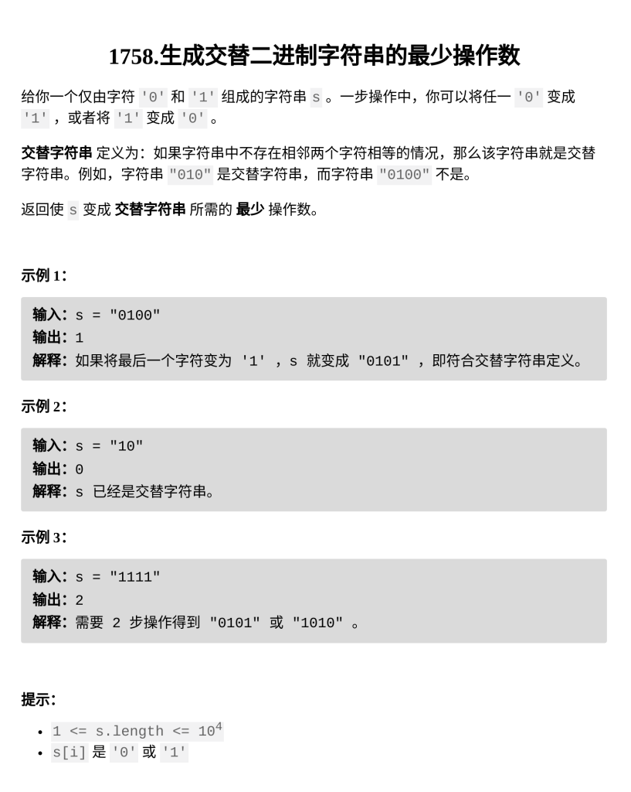

[生成交替二进制字符串的最少操作数](https://leetcode.cn/problems/minimum-changes-to-make-alternating-binary-string/submissions/702976584/?envType=daily-question&envId=2026-03-05)

题目难度：Easy



交替字符串只有两种

要么以 **1** 开头，要么以 **0** 开头

分别尝试匹配

返回：总长度 - 最大匹配数

```
class Solution {
public:
    int minOperations(string s) {
        int n=s.size();
        int a=0,b=0;
        for(int i=0;i<n;++i){
            if(i&1){
                if(s[i]=='1'){
                    a++;
                }
                else{
                    b++;
                }
            }
            else{
                if(s[i]=='0'){
                    a++;
                }
                else{
                    b++;
                }
            }
        }
        return n-max(a,b);
    }
};
```

发现 **a + b** 等于总长度

```
class Solution {
public:
    int minOperations(string s) {
        int n=s.size();
        int t=0;
        for(int i=0;i<n;++i){
            if(i&1){
                if(s[i]=='1'){
                    t++;
                }
            }
            else{
                if(s[i]=='0'){
                    t++;
                }
            }
        }
        return min(t,n-t);
    }
};
```
