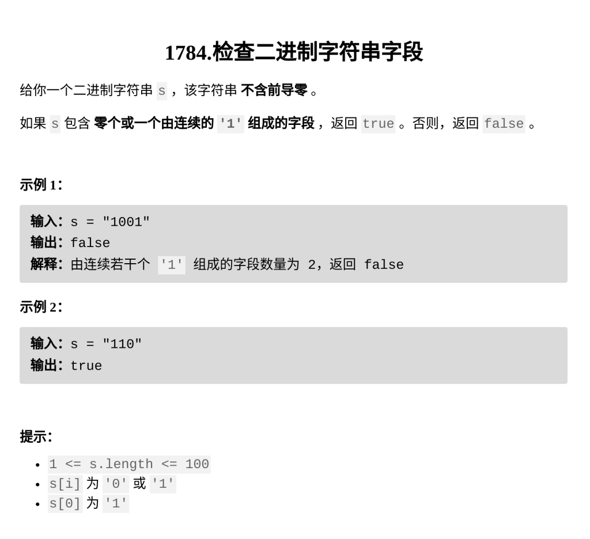

[检查二进制字符串字段](https://leetcode.cn/problems/check-if-binary-string-has-at-most-one-segment-of-ones/description/?envType=daily-question&envId=2026-03-06)

题目难度：Easy



```
class Solution {
public:
    bool checkOnesSegment(string s) {
        int cnt=s[0]=='1';
        for(int i=1;i<s.size();++i){
            if(s[i]=='1'&&s[i-1]=='0'){
                cnt++;
            }
        }
        return cnt==1||cnt==0;
    }
};
```
