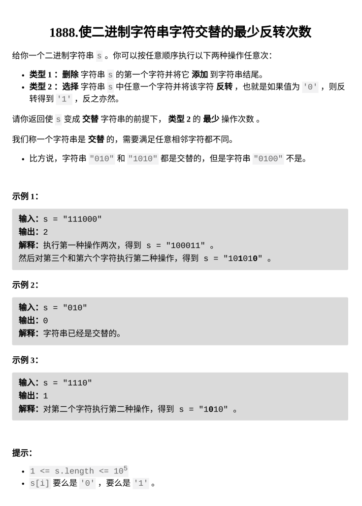

[使二进制字符串字符交替的最少反转次数](https://leetcode.cn/problems/minimum-number-of-flips-to-make-the-binary-string-alternating/?envType=daily-question&envId=2026-03-07)

题目难度：Medium



**操作 1** 相当于将字符串变成环

通过 **_`S = s + s`_** 破环为链

**操作 2** 就是 [1758生成交替二进制字符串的最少操作次数](https://leetcode.cn/problems/minimum-changes-to-make-alternating-binary-string/submissions/702976584/?envType=daily-question&envId=2026-03-05)

对 **_S_** 上每一个长度为 **_`n=s.size()`_** 的区间进行匹配

时间复杂度是 **_`O(N2)`_**

**滑动窗口**

维护长度为 **n** 的滑窗，时间复杂度 **_`O(N)`_**

```
class Solution {
public:
    int minFlips(string s) {
        int n=s.size();
        string S=s+s;
        int ans=n;
        int t=0;
        int l=0,r=0;
        while(r<n*2){
            t+=S[r]==(r&1?'0':'1');
            r++;
            if(r-l==n){
                ans=min({ans,t,n-t});
                t-=S[l]==(l&1?'0':'1');
                l++;
            }
        }
        return ans;
    }
};
```
