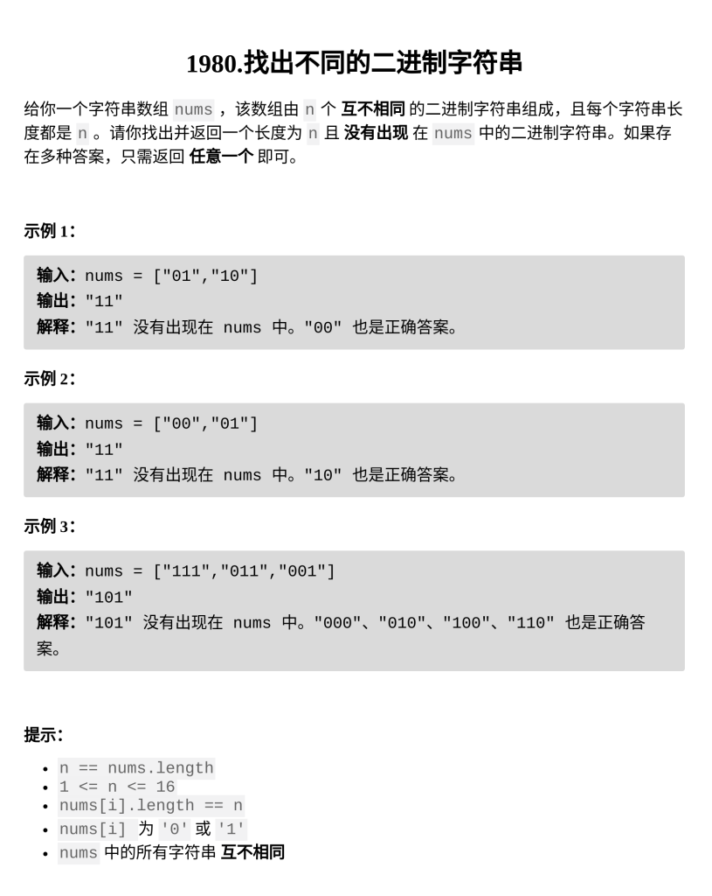

[找出不同的二进制字符串](https://leetcode.cn/problems/find-unique-binary-string/description/?envType=daily-question&envId=2026-03-08)

题目难度：Medium



**康托对角线**

对于样例二：**【 111，011，001 】**

构造一个长度为 **3** 的字符串 **ans = xxx** ，与 **【 111，011，001 】** 均不相同

**111** 的第一个数字为 **1**，令 **ans = 0xx**，则保证 **ans** 与 **111** 不同

**011** 的第二个数字为 **1**，令 **ans = 00x**，则保证 **ans** 与 **011** 不同

**001** 的第三个数字为 **1**，令 **ans = 000**，则保证 **ans** 与 **001** 不同

同理，只要保证 **ans** 与 **nums\[i\]** **都至少有一位不同**，则满足题意

时间复杂度 _**`O(N)`**_

```
class Solution {
public:
    string findDifferentBinaryString(vector<string>& nums) {
        int n=nums[0].size();
        string ans(n,'0');
        for(int i=0;i<n;++i){
            if(nums[i][i]=='0'){
                ans[i]='1';
            }
        }
        return ans;
    }
};
```
