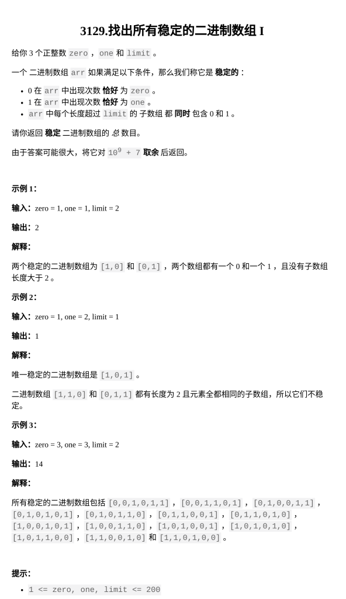

[找出所有稳定的二进制数组 I](https://leetcode.cn/problems/find-all-possible-stable-binary-arrays-i/submissions/704479914/?envType=daily-question&envId=2026-03-09)

题目难度：Medium



**记忆化搜索 / DP**

limit 的含义：最多出现连续 limit 个 1 ，最多出现连续 limit 个 0

设计 四维 dfs ( i , j , cur , x )

表示 还剩下 i 个 0，j 个 1 可用，末位填 cur ，从 cur 往右看（ 算上cur ）有连续 x 个数相同

状态转移：

dfs ( i , j , 1 , x ) = dfs ( i , j - 1 , 1 , x + 1 ) + dfs ( i , j - 1 , 0 , 1 )

dfs ( i , j , 0 , x ) = dfs ( i - 1 , j , 0 , x + 1 ) + dfs ( i - 1 , j , 1 , 1 )

base case ：

i < 0 或 j < 0 或 x > limit 时

合法方案数为 0

i = 0 时

可以知道：上一位一定是 0 ，当前还有 【 zero = 0 , one = j 】可用

末位只能填 1 ，以后也只有 1 可以填

也就是说，上一位是 0 ，这个 0 左面要填 j 个 1

当 j <= limit 时，这算作一个合法的方案

所以当 i == 0 时 返回 cur == 1 && j <= limit

同理 当 j == 0 时 返回 cur == 0 && i <= limit

```
class Solution {
    static const int P=1e9+7;
public:
    int numberOfStableArrays(int zero, int one, int limit) {
        vector mem(zero+1,vector<vector<vector<int>>>(one+1,vector<vector<int>>(2,vector<int>(limit+1,-1))));
        function<int(int,int,int,int)>dfs=[&](int i,int j,int cur,int x)->int{
            if(i<0||j<0||x>limit){
                return 0;
            }
            if(i==0){
                return cur==1&&j<=limit;
            }
            if(j==0){
                return cur==0&&i<=limit;
            }
            int &res=mem[i][j][cur][x];
            if(res==-1){
                if(cur==1){
                    res=(dfs(i,j-1,1,x+1)+dfs(i,j-1,0,1))%P;
                }
                else{
                    res=(dfs(i-1,j,1,1)+dfs(i-1,j,0,x+1))%P;
                }
            }
            return res;
        };
        return (dfs(zero,one,0,1)+dfs(zero,one,1,1))%P;
    }
};
```

时间复杂度：**_`O(zero * one * limit)`_**

理论可以过 但是 leetcode 计算的是总耗时

最后会被 【 zero = 200 , one = 200 , limit = 200 】卡掉

所以

```
class Solution {
    static const int P=1e9+7;
public:
    int numberOfStableArrays(int zero, int one, int limit) {
        if(zero+one+limit==600){
            return 587893473;
        }
        vector mem(zero+1,vector<vector<vector<int>>>(one+1,vector<vector<int>>(2,vector<int>(limit+1,-1))));
        function<int(int,int,int,int)>dfs=[&](int i,int j,int cur,int x)->int{
            if(i<0||j<0||x>limit){
                return 0;
            }
            if(i==0){
                return cur==1&&j<=limit;
            }
            if(j==0){
                return cur==0&&i<=limit;
            }
            int &res=mem[i][j][cur][x];
            if(res==-1){
                if(cur==1){
                    res=(dfs(i,j-1,1,x+1)+dfs(i,j-1,0,1))%P;
                }
                else{
                    res=(dfs(i-1,j,1,1)+dfs(i-1,j,0,x+1))%P;
                }
            }
            return res;
        };
        return (dfs(zero,one,0,1)+dfs(zero,one,1,1))%P;
    }
};
```

但面对 [找出所有稳定的二进制数组 II](https://leetcode.cn/problems/find-all-possible-stable-binary-arrays-ii/description/) 就无能为力了

使用类似组合数学的思路 ，减去所有非法的方案数 ，省去 x 这一维

比如 dfs ( i , j , 1 )

当前末位需要选 1 ，有 i 个 0 ，j 个 1 可以用

下一位选 0 -> dfs ( i , j-1 , 0 ) ，对非法答案无贡献

下一位选 1 -> dfs ( i , j-1 , 1)

如果 可用的 1 的数量（ j ）不足 limit ，那么对非法答案也无贡献

如果 j >= limit 且接下来连选 limit + 1 个 1 才会产生非法答案

我们需要计算 《 恰由当前位选 1 而产生的非法方案数 》

所以在当前位这个 1 前面再连选 **恰好** limit 个 1

再之后的一位必须是 0，只有这样才能得到《 恰由当前位选 1 而产生的非法方案数 》

如果再之后的一位选 1，可能会与 《 当前位的前一位选 1 而产生的非法方案数 》 重复计算。

此时还剩下 i 个 0， j - 1 - limit 个 1 可以用，且下一位选 0

所以《 恰由当前位选 1 而产生的非法方案数 》为 ：dfs ( i , j-1-limit , 0 )

得到状态转移方程：

dfs ( i , j , 1 ) = dfs ( i , j-1 ,0 ) + \[ dfs ( i , j-1 ,1 ) - dfs ( i , j-1-limit ,0 ) \]

同理 dfs ( i , j , 0 ) = dfs ( i-1 , j ,1 ) + \[ dfs ( i-1 , j ,0 ) - dfs ( i-1-limit , j , 1 ) \]

最后注意取余

时间复杂度：**_`O( zero * one )`_**

```
class Solution {
    static const int P=1e9+7;
public:
    int numberOfStableArrays(int zero, int one, int limit) {
        vector mem(zero+1,vector<vector<int>>(one+1,vector<int>(2,-1)));
        function<int(int,int,int)>dfs=[&](int i,int j,int k)->int{
            if(i<0||j<0){
                return 0;
            }
            if(i==0){
                return k==1&&j<=limit;
            }
            if(j==0){
                return k==0&&i<=limit;
            }
            int&res=mem[i][j][k];
            if(res==-1){
                if(k){
                    res=((dfs(i,j-1,0)+dfs(i,j-1,1))%P-dfs(i,j-1-limit,0)+P)%P;
                }
                else{
                    res=((dfs(i-1,j,0)+dfs(i-1,j,1))%P-dfs(i-1-limit,j,1)+P)%P;
                }
            }
            return res;
        };
        return (dfs(zero,one,1)+dfs(zero,one,0))%P;
    }
};
```
