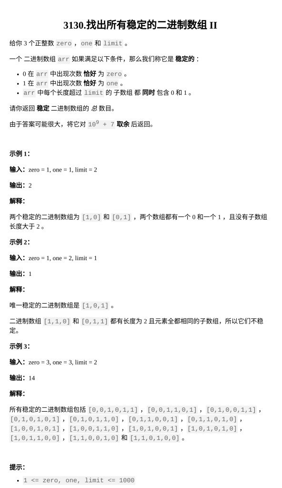

[找出所有稳定的二进制数组 II](https://leetcode.cn/problems/find-all-possible-stable-binary-arrays-ii/description/?envType=daily-question&envId=2026-03-10)

题目难度：Hard

[找出所有稳定的二进制数组 I](https://ssbt.lilys.top/?p=548) 的数据加强版。
