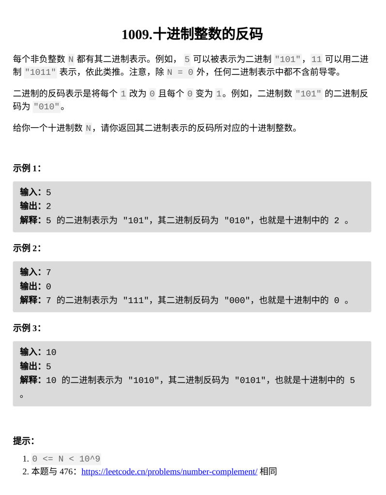

[十进制整数的反码](https://leetcode.cn/problems/complement-of-base-10-integer/?envType=daily-question&envId=2026-03-11)

题目难度：Easy



**模拟进制**

特判 n = 0

时间复杂度：**_`O(logN)`_**

```
class Solution {
public:
    int bitwiseComplement(int n) {
        if(n==0){
            return 1; 
        }
        int res=0;
        int b=1;
        while(n){
            if(!(n&1)){
                res+=b;
            }
            b<<=1;
            n>>=1;
        }
        return res;
    }
};
```

**反码**

1001101 的反码是 0110010

1001101 在二进制下有 7 位

1001101 与 1111111 异或

得到 0110010 就是它的反码

时间复杂度：**_`O(logN)`_**

```
class Solution {
    int getbit(int x){
        int b=0;
        while(x){
            b++;
            x>>=1;
        }
        return b;
    }
public:
    int bitwiseComplement(int n) {
        if(n==0){
            return 1;
        }
        return n^((1<<(getbit(n)))-1);
    }
};
```
